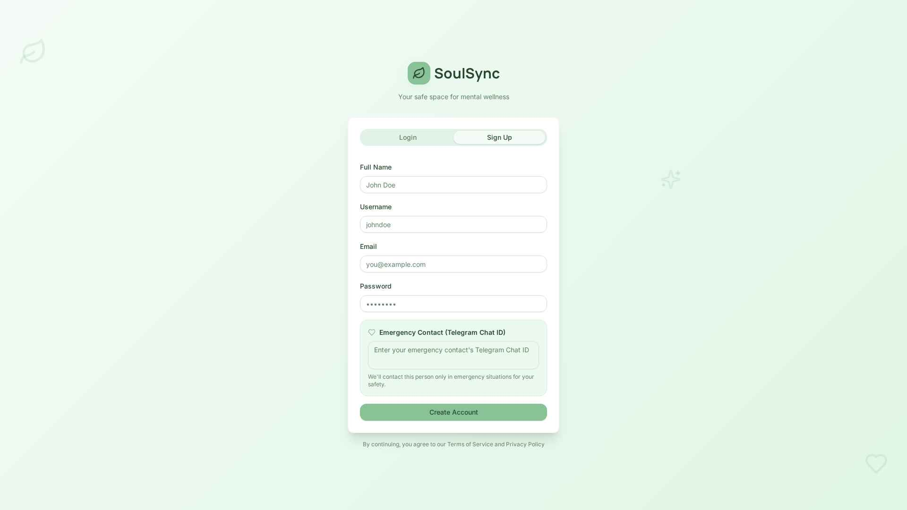
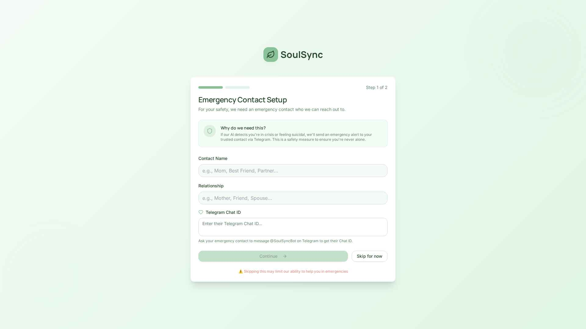
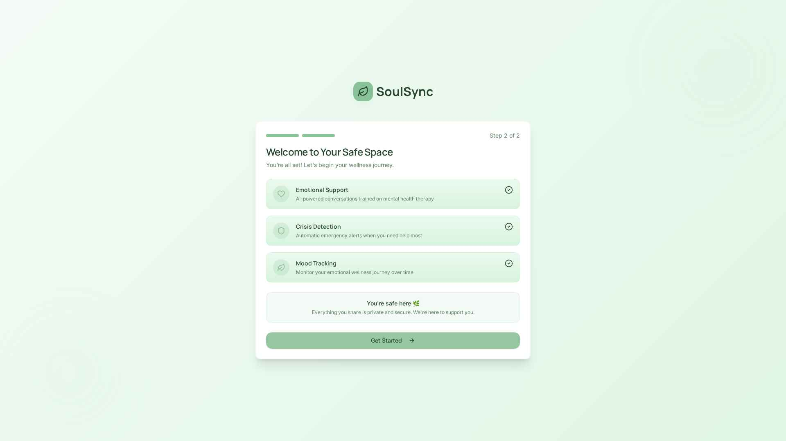
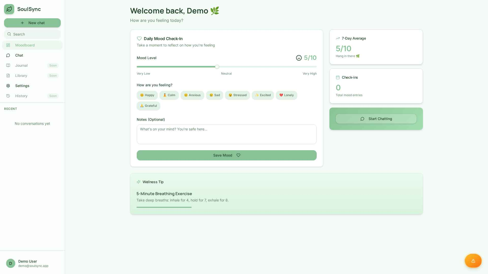
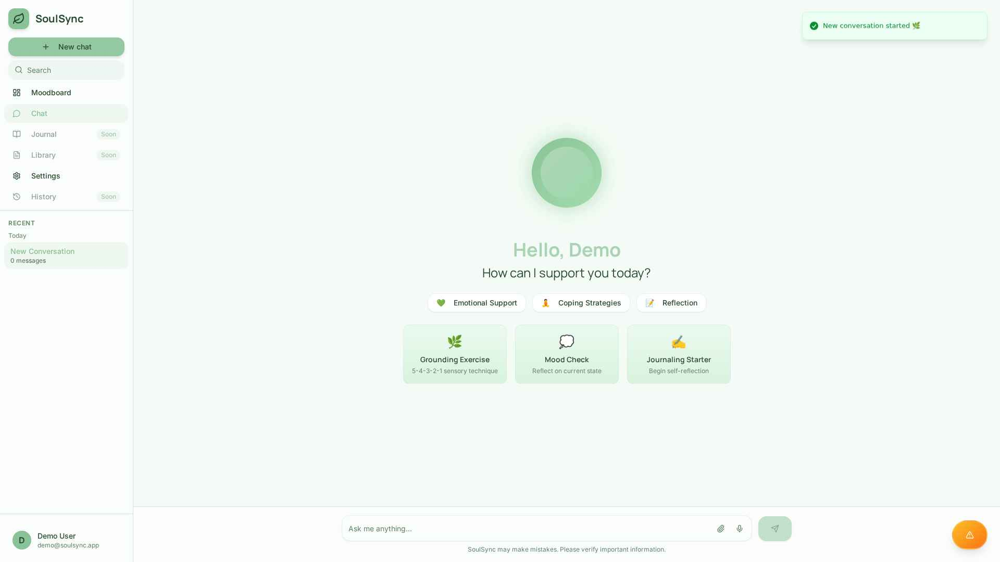
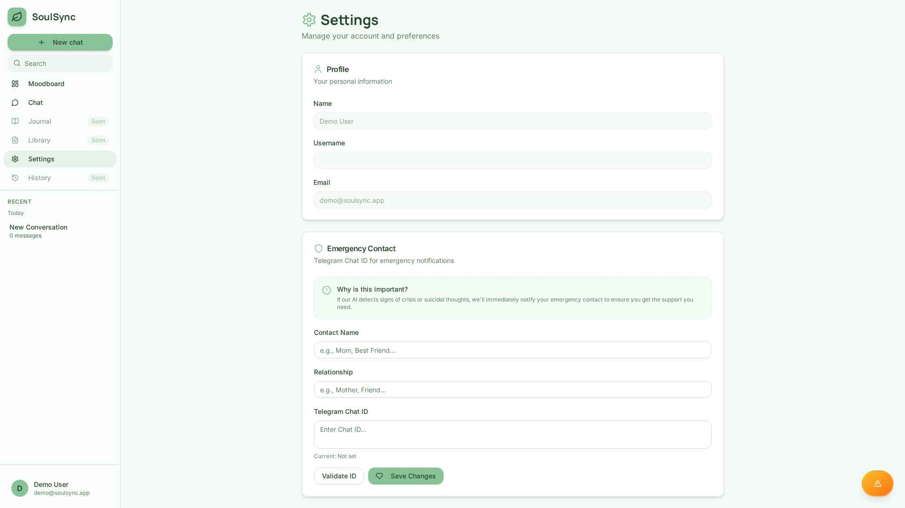

<div align="center">

# 🌿 SoulSync 2.0


**Your AI-Powered Mental Health Companion**

*A compassionate desktop application providing 24/7 mental health support through AI conversations, mood tracking, and emergency assistance.*

[](https://opensource.org/licenses/MIT)
[](https://www.electronjs.org/)
[](https://reactjs.org/)
[](https://fastapi.tiangolo.com/)
[](https://www.python.org/)

[✨ Features](#-features) • [📸 Screenshots](#-screenshots) • [🚀 Quick Start](#-quick-start) • [📖 Documentation](#-documentation) • [🛠️ Development](#-development)

</div>

---

## 📖 Table of Contents

- [Overview](#-overview)
- [Why SoulSync?](#-why-soulsync)
- [Features](#-features)
- [Screenshots](#-screenshots)
- [Tech Stack](#-tech-stack)
- [Prerequisites](#-prerequisites)
- [Quick Start](#-quick-start)
- [Installation](#-installation)
- [Running as Desktop App](#-running-as-desktop-app)
- [Building for Distribution](#-building-for-distribution)
- [Project Structure](#-project-structure)
- [Configuration](#-configuration)
- [Development Guide](#-development-guide)
- [Troubleshooting](#-troubleshooting)
- [Contributing](#-contributing)
- [License](#-license)

---

## 🌟 Overview

**SoulSync 2.0** is a privacy-first, desktop mental health companion designed to provide a safe, secure, and supportive environment for users seeking emotional support. Built with Electron, React, and FastAPI, SoulSync offers real-time AI conversations, comprehensive mood tracking, crisis detection, and emergency contact integration.

### 💡 Why SoulSync?

- 🔒 **Privacy First**: All data stored locally on your device - no cloud storage
- 🤖 **AI-Powered Support**: Empathetic AI conversations available 24/7
- 📊 **Mood Tracking**: Visualize and understand your emotional patterns over time
- 🚨 **Crisis Detection**: Automatic detection and emergency contact notification
- 💚 **Calming Design**: Wellness-focused green theme designed for comfort and peace
- 🖥️ **True Desktop App**: Runs completely offline after installation
- 🆓 **Free & Open Source**: No subscriptions, no hidden costs

---

## ✨ Features

### 🔐 Authentication & Onboarding
- ✅ Secure local user registration and login
- ✅ Emergency contact setup with Telegram integration
- ✅ Personalized onboarding experience
- ✅ Privacy-focused - all data stays on your device

### 💬 AI Chat Interface
- ✅ Real-time conversations with empathetic AI
- ✅ Context-aware responses trained on mental health therapy
- ✅ Conversation history with easy management
- ✅ Crisis detection and automatic support
- ✅ Supportive responses for anxiety, depression, and stress

### 📈 Mood Dashboard
- ✅ Daily mood tracking with interactive slider (1-10 scale)
- ✅ Emotion tags: Happy, Sad, Anxious, Calm, Stressed, Excited, Lonely, Grateful
- ✅ Visual mood history with statistics
- ✅ 7-day mood average tracking
- ✅ Personalized wellness tips and recommendations
- ✅ Optional notes for journaling thoughts

### 🚨 SOS Emergency Button
- ✅ Quick access panic button (Ctrl/Cmd+Shift+E)
- ✅ Instant notification to emergency contacts via Telegram
- ✅ Desktop notifications for immediate response
- ✅ Confirmation modal to prevent accidental triggers
- ✅ Visible from all pages

### ⚙️ Settings & Customization
- ✅ Profile management (name, email, username)
- ✅ Emergency contact configuration
- ✅ Telegram Chat ID validation
- ✅ Data export functionality (coming soon)
- ✅ Account management

### 🖥️ Desktop Features
- ✅ **System tray integration** - minimize to tray
- ✅ **Global keyboard shortcuts** - quick access anywhere
- ✅ **Desktop notifications** - stay informed
- ✅ **Window state persistence** - remembers size and position
- ✅ **Cross-platform** - Windows, macOS, and Linux support
- ✅ **Offline-first** - works without internet after installation

---

## 📸 Screenshots

### Authentication & Onboarding

<div align="center">

#### Login Page
*Clean, calming interface with wellness-focused aesthetics*


#### Sign Up Page
*Secure registration with optional emergency contact setup*



#### Emergency Contact Setup
*Configure Telegram emergency notifications for safety*



#### Welcome Screen
*Introduction to SoulSync features*



</div>

---

### Main Application

<div align="center">

#### Mood Dashboard
*Track your emotional wellness with daily mood check-ins*



**Features visible:**
- Daily mood check-in with slider (1-10)
- Emotion tag selection (Happy, Calm, Anxious, Sad, Stressed, Excited, Lonely, Grateful)
- 7-day mood average tracking
- Wellness tips section
- Quick access to AI chat
- Sidebar navigation

---

#### AI Chat Interface
*Get support from empathetic AI trained on mental health therapy*



**Features visible:**
- Friendly greeting with user's name
- Quick action buttons (Emotional Support, Coping Strategies, Reflection)
- Conversation starters (Grounding Exercise, Mood Check, Journaling Starter)
- Clean message input with voice and attachment support
- Sidebar showing recent conversations

---

#### Settings Page
*Manage your profile and emergency contacts*



**Features visible:**
- Profile information management
- Emergency contact configuration with Telegram
- Clear explanation of safety features
- Easy-to-use form interface

</div>

---

## 🛠️ Tech Stack

### Frontend
| Technology | Version | Purpose |
|-----------|---------|---------|
| **Electron** | ^28.0.0 | Desktop application framework |
| **React** | ^19.0.0 | UI library with hooks |
| **React Router** | ^7.5.1 | Client-side routing |
| **Tailwind CSS** | ^3.4.17 | Utility-first styling |
| **Framer Motion** | ^12.23.25 | Smooth animations |
| **Radix UI** | Latest | Accessible component primitives |
| **Chart.js** | ^4.5.1 | Mood visualization charts |
| **Lucide React** | ^0.507.0 | Beautiful icon set |
| **Axios** | ^1.8.4 | HTTP client for API calls |

### Backend
| Technology | Version | Purpose |
|-----------|---------|---------|
| **FastAPI** | 0.110.1 | Modern Python web framework |
| **Uvicorn** | 0.25.0 | Lightning-fast ASGI server |
| **Pydantic** | ^2.6.4 | Data validation with type hints |
| **Aiofiles** | ^25.1.0 | Async file operations |
| **Python** | 3.11+ | Programming language |

### Storage
- **Local JSON Files** - All user data, conversations, and mood history
- **electron-store** ^8.1.0 - Persistent application settings
- **No Database Required** - Works completely offline

### Development Tools
- **CRACO** - Create React App Configuration Override
- **electron-builder** ^24.9.1 - Package and distribute application
- **Concurrently** ^8.2.2 - Run multiple processes
- **Wait-on** ^7.2.0 - Wait for resources before starting

---

## 📋 Prerequisites

Before installing SoulSync, ensure you have the following on your system:

### Required Software

#### For Running the Development Version:
```bash
✅ Node.js >= 16.x (Recommended: v20.x)
✅ npm >= 8.x or Yarn >= 1.22.x
✅ Python >= 3.11.x
✅ pip (Python package manager)
```

#### For Using the Packaged Desktop App:
```bash
✅ No dependencies required!
✅ Just download and install the app for your platform
```

### Verify Your Installation

```bash
# Check Node.js version
node --version
# Expected: v16.x or higher

# Check npm version
npm --version
# Expected: 8.x or higher

# Check Yarn version (if using Yarn)
yarn --version
# Expected: 1.22.x or higher

# Check Python version
python3 --version
# Expected: Python 3.11 or higher

# Check pip version
pip --version
# Expected: pip 21.x or higher
```

---

## 🚀 Quick Start

### Option 1: Download Pre-built Desktop App (Recommended for Users)

**Coming Soon!** Pre-built installers will be available for:
- 🪟 **Windows** - `.exe` installer
- 🍎 **macOS** - `.dmg` disk image
- 🐧 **Linux** - `.AppImage` or `.deb` package

Simply download, install, and run. No technical setup required!

### Option 2: Run from Source (For Developers)

```bash
# 1. Clone the repository
git clone https://github.com/yourusername/soulsync-desktop.git
cd soulsync-desktop

# 2. Install all dependencies (this will take a few minutes)
yarn install

# 3. Start the application in development mode
yarn dev

# The app will open automatically!
```

That's it! SoulSync will start with both the backend and frontend running.

---

## 📥 Installation

### Step 1: Clone the Repository

```bash
git clone https://github.com/yourusername/soulsync-desktop.git
cd soulsync-desktop
```

### Step 2: Install Dependencies

#### Automated Installation (Recommended)

```bash
# This installs everything: root, frontend, and backend dependencies
yarn install
```

The `postinstall` script automatically:
1. ✅ Installs root Electron dependencies
2. ✅ Installs frontend React dependencies  
3. ✅ Installs backend Python dependencies

#### Manual Installation (If Needed)

```bash
# Install root dependencies (Electron)
yarn install

# Install frontend dependencies
cd frontend
yarn install
cd ..

# Install backend dependencies
cd backend
pip install -r requirements.txt
cd ..
```

### Step 3: Environment Configuration

#### Backend Configuration

The backend uses local JSON file storage and doesn't require MongoDB or any external database.

**Optional: Configure Telegram Emergency Notifications**

If you want to enable emergency contact notifications via Telegram:

1. Create a Telegram Bot:
   - Open Telegram and search for `@BotFather`
   - Send `/newbot` and follow the instructions
   - Copy your bot token

2. Update `backend/.env`:
```env
# Optional: Telegram Bot for Emergency Alerts
TELEGRAM_BOT_TOKEN=your_bot_token_here
```

3. Get your Telegram Chat ID:
   - Send a message to `@userinfobot` on Telegram
   - It will reply with your Chat ID
   - Users can configure this in the Settings page

#### Frontend Configuration

The frontend is already configured to communicate with the local backend:

```env
# frontend/.env (already configured)
REACT_APP_BACKEND_URL=http://localhost:8001
```

**No changes needed!** The app is ready to run.

---

## 🖥️ Running as Desktop App

### Development Mode (Hot Reload)

Run all services together with hot reload enabled:

```bash
# Start everything: backend + frontend + Electron
yarn dev
```

This command:
- ✅ Starts the FastAPI backend on `localhost:8001`
- ✅ Starts the React dev server on `localhost:3000`
- ✅ Launches the Electron desktop window
- ✅ Enables hot reload for both frontend and backend

### Production Mode (Local)

To run the app with production builds:

```bash
# 1. Build the frontend
cd frontend
yarn build
cd ..

# 2. Start Electron with production build
yarn start
```

### Keyboard Shortcuts

When running the desktop app, use these shortcuts:

| Shortcut | Action |
|----------|--------|
| `Ctrl/Cmd + N` | New chat conversation |
| `Ctrl/Cmd + K` | Open search |
| `Ctrl/Cmd + ,` | Open settings |
| `Ctrl/Cmd + Shift + E` | 🚨 Trigger SOS emergency button |
| `Ctrl/Cmd + Q` | Quit application |

---

## 📦 Building for Distribution

Create standalone installers for different platforms:

### Prerequisites for Building

**Windows:**
- Windows 7 or later

**macOS:**
- macOS 10.12 or later
- Xcode Command Line Tools: `xcode-select --install`

**Linux:**
- Build tools: `sudo apt-get install build-essential`

### Build Commands

```bash
# Build for your current platform
yarn electron:build

# Build for specific platforms
yarn electron:build:win      # Windows .exe installer
yarn electron:build:mac      # macOS .dmg image
yarn electron:build:linux    # Linux .AppImage and .deb
```

### Build Output

Built applications will be in the `dist/` directory:

```
dist/
├── SoulSync Setup.exe        # Windows installer (NSIS)
├── SoulSync.dmg              # macOS disk image
├── SoulSync.AppImage         # Linux AppImage (universal)
└── soulsync_amd64.deb        # Debian package
```

### Testing the Build

```bash
# Navigate to dist folder
cd dist

# On Windows
./SoulSync Setup.exe

# On macOS
open SoulSync.dmg

# On Linux
chmod +x SoulSync.AppImage
./SoulSync.AppImage
```

### Build Configuration

The build configuration is in `package.json`:

```json
{
  "build": {
    "appId": "com.soulsync.desktop",
    "productName": "SoulSync",
    "directories": {
      "output": "dist",
      "buildResources": "electron/resources"
    },
    "files": [
      "electron/**/*",
      "frontend/build/**/*",
      "backend/**/*"
    ]
  }
}
```

---

## 📁 Project Structure

```
soulsync-desktop/
│
├── electron/                      # Electron main process
│   ├── main.js                   # Main process entry (window, tray, shortcuts)
│   ├── preload.js                # Preload script for secure IPC
│   └── icon.png                  # Application icon
│
├── frontend/                      # React frontend
│   ├── public/                   # Static assets
│   ├── src/
│   │   ├── components/           # React components
│   │   │   ├── ui/              # Reusable UI components (Radix)
│   │   │   ├── AppShell.jsx     # Main application layout
│   │   │   ├── Sidebar.jsx      # Navigation sidebar
│   │   │   ├── SOSButton.jsx    # Emergency panic button
│   │   │   └── ...
│   │   ├── pages/               # Page components
│   │   │   ├── AuthPage.jsx     # Login/Signup
│   │   │   ├── OnboardingPage.jsx  # User onboarding
│   │   │   ├── MoodDashboard.jsx   # Mood tracking
│   │   │   ├── ChatPage.jsx     # AI chat interface
│   │   │   └── SettingsPage.jsx # User settings
│   │   ├── hooks/               # Custom React hooks
│   │   │   ├── useAuth.js       # Authentication
│   │   │   ├── useElectron.js   # Electron integration
│   │   │   ├── useConversations.js  # Chat management
│   │   │   └── useMood.js       # Mood tracking
│   │   ├── lib/                 # Utility functions
│   │   ├── App.js               # Root component
│   │   └── index.js             # Entry point
│   ├── package.json
│   ├── craco.config.js          # CRACO configuration
│   ├── tailwind.config.js       # Tailwind CSS config
│   └── .env                     # Environment variables
│
├── backend/                       # FastAPI backend
│   ├── server.py                 # Main FastAPI application
│   ├── data/                     # Local JSON storage
│   │   ├── users.json           # User data
│   │   ├── conversations.json   # Chat history
│   │   ├── mood_entries.json    # Mood tracking data
│   │   └── status_checks.json   # System status
│   ├── requirements.txt          # Python dependencies
│   └── .env                      # Backend configuration
│
├── screenshots/                   # Application screenshots
│   ├── 01-auth-login.png
│   ├── 02-auth-signup.png
│   └── ...
│
├── package.json                   # Root package.json (Electron)
├── yarn.lock                      # Dependency lock file
└── README.md                      # This file
```

### Key Files Explained

| File | Purpose |
|------|---------|
| `electron/main.js` | Electron main process - manages window, tray, keyboard shortcuts |
| `electron/preload.js` | Secure bridge between Electron and React |
| `frontend/src/App.js` | React root component with routing |
| `backend/server.py` | FastAPI backend with all API endpoints |
| `package.json` (root) | Electron and build configuration |
| `frontend/package.json` | React dependencies and scripts |
| `backend/requirements.txt` | Python dependencies |

---

## ⚙️ Configuration

### Electron Configuration

Desktop app settings are configured in the root `package.json`:

```json
{
  "build": {
    "appId": "com.soulsync.desktop",
    "productName": "SoulSync",
    "win": {
      "target": ["nsis"],
      "icon": "electron/icon.png"
    },
    "mac": {
      "target": ["dmg"],
      "category": "public.app-category.healthcare-fitness"
    },
    "linux": {
      "target": ["AppImage", "deb"],
      "category": "Education"
    }
  }
}
```

### Security Configuration

SoulSync follows Electron security best practices:

- ✅ **Context Isolation** - Enabled
- ✅ **Node Integration** - Disabled in renderer
- ✅ **Preload Script** - Used for secure IPC
- ✅ **Remote Module** - Disabled
- ✅ **External Links** - Opened in default browser

### Window Configuration

- **Default size**: 1280x800
- **Minimum size**: 1024x600
- **Window state persistence**: Remembers size, position, maximized state
- **Minimize to tray**: Optional, configurable

### Backend API Endpoints

| Endpoint | Method | Description |
|----------|--------|-------------|
| `/api/` | GET | Health check |
| `/api/health` | GET | Detailed health status |
| `/api/users/register` | POST | Register new user |
| `/api/users/login` | POST | User login |
| `/api/users/{id}` | GET | Get user profile |
| `/api/users/{id}` | PATCH | Update user |
| `/api/chat` | POST | Send chat message |
| `/api/conversations/{user_id}` | GET | Get all conversations |
| `/api/mood` | POST | Create mood entry |
| `/api/mood/{user_id}` | GET | Get mood history |
| `/api/mood/{user_id}/stats` | GET | Get mood statistics |
| `/api/emergency/notify` | POST | Send emergency alert |

---

## 💻 Development Guide

### Project Setup

```bash
# Clone and install
git clone https://github.com/yourusername/soulsync-desktop.git
cd soulsync-desktop
yarn install
```

### Development Workflow

#### 1. Start Development Servers

```bash
# Terminal 1: Start everything
yarn dev

# Or run separately:

# Terminal 1: Backend only
cd backend
uvicorn server:app --reload --host 0.0.0.0 --port 8001

# Terminal 2: Frontend only
cd frontend
yarn start

# Terminal 3: Electron only
yarn start
```

#### 2. Making Changes

**Frontend Changes:**
- Edit files in `frontend/src/`
- Hot reload is automatic
- Changes appear instantly

**Backend Changes:**
- Edit `backend/server.py`
- Uvicorn auto-reloads with `--reload` flag
- Changes applied automatically

**Electron Changes:**
- Edit `electron/main.js` or `electron/preload.js`
- Restart Electron: Close window and run `yarn start`

### Adding New Features

#### Frontend Component
```bash
# Create new component
touch frontend/src/components/NewFeature.jsx
```

```jsx
// frontend/src/components/NewFeature.jsx
import React from 'react';

export const NewFeature = () => {
  return (
    <div className="p-4 bg-primary/10 rounded-lg">
      <h2 className="text-2xl font-bold text-primary">New Feature</h2>
      <p className="text-muted-foreground">Feature description</p>
    </div>
  );
};
```

#### Backend API Endpoint
```python
# backend/server.py

@api_router.post("/new-feature")
async def new_feature(data: dict):
    """New feature endpoint."""
    # Process data
    result = {"success": True, "data": data}
    return result
```

#### Electron IPC Handler
```javascript
// electron/main.js

ipcMain.handle('new-feature', async (event, data) => {
  console.log('New feature called:', data);
  return { success: true };
});
```

```javascript
// electron/preload.js

contextBridge.exposeInMainWorld('electron', {
  newFeature: (data) => ipcRenderer.invoke('new-feature', data)
});
```

### Code Style

#### JavaScript/React
- Follow ESLint configuration
- Use functional components with hooks
- Use Tailwind CSS utility classes
- Follow component naming conventions

#### Python
- Follow PEP 8 style guide
- Use type hints with Pydantic models
- Async/await for all I/O operations
- Clear docstrings for all functions

### Testing

```bash
# Frontend tests (if configured)
cd frontend
yarn test

# Backend tests
cd backend
pytest

# E2E tests (coming soon)
yarn test:e2e
```

### Hot Reload

- **Frontend**: React hot reload works automatically
- **Backend**: Uvicorn auto-reloads with `--reload` flag
- **Electron Main Process**: Manual restart required
- **Electron Renderer**: Uses React hot reload

---

## 🐛 Troubleshooting

### Common Issues and Solutions

#### Issue 1: Dependencies Won't Install

**Problem**: `yarn install` fails or takes too long

**Solutions**:
```bash
# Clear yarn cache
yarn cache clean

# Remove node_modules and reinstall
rm -rf node_modules frontend/node_modules
yarn install

# Use npm instead if Yarn fails
npm install
cd frontend && npm install
```

#### Issue 2: Electron Won't Start

**Problem**: `yarn start` shows Electron errors

**Solutions**:
```bash
# Check if Electron is installed
ls node_modules/.bin/electron

# Reinstall Electron
yarn add electron@^28.0.0 --dev

# Clear Electron cache
rm -rf node_modules/electron
yarn install

# Try rebuilding native modules
cd node_modules/electron && npm run install
```

#### Issue 3: Backend Won't Start

**Problem**: Backend server fails to start

**Solutions**:
```bash
# Check Python dependencies
cd backend
pip list | grep fastapi

# Reinstall requirements
pip install -r requirements.txt --force-reinstall

# Check if port 8001 is available
lsof -i :8001          # macOS/Linux
netstat -ano | findstr :8001  # Windows

# Start manually to see errors
cd backend
python -m uvicorn server:app --reload --port 8001
```

#### Issue 4: Frontend Build Fails

**Problem**: `yarn build` fails with errors

**Solutions**:
```bash
cd frontend

# Clear cache
rm -rf node_modules/.cache

# Check for syntax errors
npx eslint src/

# Reinstall dependencies
rm -rf node_modules
yarn install

# Try building again
yarn build
```

#### Issue 5: "Cannot find module 'aiofiles'"

**Problem**: Backend fails with import error

**Solution**:
```bash
cd backend
pip install aiofiles
pip freeze > requirements.txt
```

#### Issue 6: Data Not Persisting

**Problem**: User data disappears after restart

**Check**:
```bash
# Verify data directory exists
ls -la backend/data/

# Check file permissions
chmod 755 backend/data/
chmod 644 backend/data/*.json

# View data files
cat backend/data/users.json
```

#### Issue 7: Telegram Bot Not Working

**Problem**: Emergency notifications not sent

**Solutions**:
1. Verify bot token in `backend/.env`:
   ```env
   TELEGRAM_BOT_TOKEN=123456:ABC-DEF...
   ```
2. Test bot token:
   ```bash
   curl "https://api.telegram.org/bot<YOUR_BOT_TOKEN>/getMe"
   ```
3. Verify Chat ID is correct (send message to `@userinfobot`)

#### Issue 8: Port Already in Use

**Problem**: Backend or frontend port is already in use

**Solutions**:
```bash
# Kill process on port 8001 (backend)
lsof -ti:8001 | xargs kill -9    # macOS/Linux
netstat -ano | findstr :8001     # Windows - note PID, then:
taskkill /PID <PID> /F           # Windows

# Kill process on port 3000 (frontend)
lsof -ti:3000 | xargs kill -9    # macOS/Linux
```

### Debug Mode

Enable debug logging:

```bash
# Backend debug mode
cd backend
DEBUG=1 uvicorn server:app --reload --log-level debug

# Frontend debug mode
cd frontend
REACT_APP_DEBUG=true yarn start

# Electron debug mode with DevTools
# DevTools automatically open in development mode
```

### Getting Help

If you encounter issues not listed here:

1. **Check the logs**:
   ```bash
   # Backend logs
   tail -f backend/logs/app.log
   
   # Frontend console
   # Open DevTools in Electron: View → Toggle Developer Tools
   ```

2. **Search existing issues** on GitHub

3. **Open a new issue** with:
   - Error messages (full stack trace)
   - Steps to reproduce
   - System information:
     ```bash
     node --version
     python --version
     yarn --version
     uname -a  # macOS/Linux
     systeminfo # Windows
     ```

4. **Join our community**:
   - Discord: [discord.gg/soulsync](https://discord.gg/soulsync)
   - Reddit: [r/soulsync](https://reddit.com/r/soulsync)

---

## 🤝 Contributing

We welcome contributions from the community! Here's how you can help:

### Types of Contributions

- 🐛 **Bug Reports** - Report issues you encounter
- ✨ **Feature Requests** - Suggest new features
- 📝 **Documentation** - Improve or translate docs
- 💻 **Code** - Submit bug fixes or new features
- 🎨 **Design** - Improve UI/UX
- 🧪 **Testing** - Write tests or test releases

### Development Workflow

1. **Fork the Repository**
   ```bash
   # Click "Fork" on GitHub, then:
   git clone https://github.com/YOUR_USERNAME/soulsync-desktop.git
   cd soulsync-desktop
   ```

2. **Create a Feature Branch**
   ```bash
   git checkout -b feature/amazing-feature
   # or
   git checkout -b fix/bug-description
   ```

3. **Make Your Changes**
   - Write clean, documented code
   - Follow existing code style
   - Add comments for complex logic
   - Test your changes thoroughly

4. **Commit Your Changes**
   ```bash
   git add .
   git commit -m "feat: add amazing feature"
   ```

   **Commit Message Format:**
   ```
   <type>: <description>

   [optional body]
   [optional footer]
   ```

   **Types:**
   - `feat:` - New feature
   - `fix:` - Bug fix
   - `docs:` - Documentation changes
   - `style:` - Code style (formatting, no logic change)
   - `refactor:` - Code refactoring
   - `test:` - Adding or updating tests
   - `chore:` - Maintenance tasks

5. **Push to Your Fork**
   ```bash
   git push origin feature/amazing-feature
   ```

6. **Create a Pull Request**
   - Go to the original repository
   - Click "New Pull Request"
   - Select your branch
   - Fill in the PR template
   - Submit for review

### Code Review Process

1. **Automated Checks** - CI/CD runs tests and linting
2. **Maintainer Review** - Core team reviews code
3. **Feedback** - Address any requested changes
4. **Approval** - Once approved, PR is merged
5. **Release** - Your contribution is included in the next release

### Development Guidelines

#### General Rules
- ✅ Keep changes focused and atomic
- ✅ Write clear commit messages
- ✅ Add tests for new features
- ✅ Update documentation
- ✅ Follow the existing code style

#### Frontend Guidelines
- Use functional components with hooks
- Keep components small and focused
- Use Tailwind CSS for styling
- Add `data-testid` for testing
- Ensure accessibility (ARIA labels)

#### Backend Guidelines
- Use async/await for I/O operations
- Add type hints with Pydantic
- Write clear docstrings
- Handle errors gracefully
- Log important events

### Community Guidelines

- **Be respectful and inclusive** - treat everyone with kindness
- **Help others learn** - we're all here to grow
- **Give constructive feedback** - focus on improvement
- **Maintain a positive environment** - mental health matters

### Recognition

Contributors will be:
- ✨ Listed in the CONTRIBUTORS.md file
- 🎉 Mentioned in release notes
- 💚 Thanked in the project README
- 🏆 Eligible for special Discord roles

---

## 📄 License

This project is licensed under the **MIT License**.

```
MIT License

Copyright (c) 2024 SoulSync Team

Permission is hereby granted, free of charge, to any person obtaining a copy
of this software and associated documentation files (the "Software"), to deal
in the Software without restriction, including without limitation the rights
to use, copy, modify, merge, publish, distribute, sublicense, and/or sell
copies of the Software, and to permit persons to whom the Software is
furnished to do so, subject to the following conditions:

The above copyright notice and this permission notice shall be included in all
copies or substantial portions of the Software.

THE SOFTWARE IS PROVIDED "AS IS", WITHOUT WARRANTY OF ANY KIND, EXPRESS OR
IMPLIED, INCLUDING BUT NOT LIMITED TO THE WARRANTIES OF MERCHANTABILITY,
FITNESS FOR A PARTICULAR PURPOSE AND NONINFRINGEMENT. IN NO EVENT SHALL THE
AUTHORS OR COPYRIGHT HOLDERS BE LIABLE FOR ANY CLAIM, DAMAGES OR OTHER
LIABILITY, WHETHER IN AN ACTION OF CONTRACT, TORT OR OTHERWISE, ARISING FROM,
OUT OF OR IN CONNECTION WITH THE SOFTWARE OR THE USE OR OTHER DEALINGS IN THE
SOFTWARE.
```

### What This Means

✅ **Free to use** - personal or commercial  
✅ **Free to modify** - adapt to your needs  
✅ **Free to distribute** - share with others  
✅ **Free to sublicense** - include in your projects  

❗ **No warranty** - use at your own risk  
❗ **Attribution required** - keep the copyright notice  

---

## 🙏 Acknowledgments

### Technologies

- **[Electron](https://www.electronjs.org/)** - Making desktop apps with web technologies possible
- **[React](https://reactjs.org/)** - Powerful and flexible UI framework
- **[FastAPI](https://fastapi.tiangolo.com/)** - Modern, fast Python web framework
- **[Radix UI](https://www.radix-ui.com/)** - Accessible, unstyled component primitives
- **[Tailwind CSS](https://tailwindcss.com/)** - Utility-first CSS framework
- **[Lucide Icons](https://lucide.dev/)** - Beautiful icon set
- **[Framer Motion](https://www.framer.com/motion/)** - Production-ready animations

### Inspiration

- Mental health professionals worldwide
- Open source mental health initiatives
- The supportive developer community

### Special Thanks

- All contributors who help improve SoulSync
- Mental health advocates and users
- The open source community

---

## 📞 Contact & Support

### Get Help

- 📖 **Documentation**: This README and [docs/](docs/) folder
- 🐛 **Bug Reports**: [GitHub Issues](https://github.com/yourusername/soulsync-desktop/issues)
- 💡 **Feature Requests**: [GitHub Discussions](https://github.com/yourusername/soulsync-desktop/discussions)
- 💬 **Community Chat**: [Discord Server](https://discord.gg/soulsync)

### Mental Health Resources

**If you're in crisis, please reach out:**

- 🇺🇸 **USA**: 988 (Suicide & Crisis Lifeline)
- 🇬🇧 **UK**: 116 123 (Samaritans)
- 🇨🇦 **Canada**: 1-833-456-4566 (Talk Suicide Canada)
- 🇦🇺 **Australia**: 13 11 14 (Lifeline)
- 🌍 **International**: [findahelpline.com](https://findahelpline.com)

**SoulSync is a support tool, not a replacement for professional help.**

### Connect With Us

- 🐦 **Twitter**: [@SoulSyncApp](https://twitter.com/soulsyncapp)
- 📧 **Email**: support@soulsync.app
- 💬 **Discord**: [Join our community](https://discord.gg/soulsync)
- 🌐 **Website**: [soulsync.app](https://soulsync.app)

---

## 🌟 Star History

If you find SoulSync helpful, please consider giving it a star ⭐

Your support helps us reach more people who need mental health support.

---

## 🗺️ Roadmap

### Coming Soon (v2.1)

- [ ] AI model integration (GPT-4, Claude, etc.)
- [ ] Voice input for chat
- [ ] Mood visualization charts with trends
- [ ] Daily wellness reminders
- [ ] Journaling feature
- [ ] Export conversation history
- [ ] Multiple language support
- [ ] Dark mode improvements

### Future Plans (v3.0)

- [ ] Mobile app companion (iOS/Android)
- [ ] End-to-end encryption for cloud sync
- [ ] Group therapy sessions
- [ ] Integration with wearables (Apple Watch, Fitbit)
- [ ] Meditation timer and guides
- [ ] Sleep tracking integration
- [ ] Professional therapist matching
- [ ] Insurance integration

### Your Ideas

Have a feature idea? [Share it on GitHub Discussions!](https://github.com/yourusername/soulsync-desktop/discussions)

---

<div align="center">

## 💚 Made with Love by the SoulSync Team

*Your mental health matters. You're not alone.*

**Thank you for using SoulSync!**

[⬆ Back to Top](#-soulsync-20)

---

**Star ⭐ this repository if SoulSync helped you!**

[](https://github.com/yourusername/soulsync-desktop/stargazers)
[](https://github.com/yourusername/soulsync-desktop/network/members)

</div>
